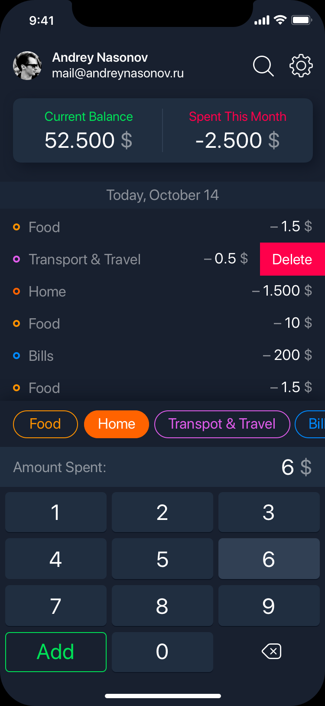
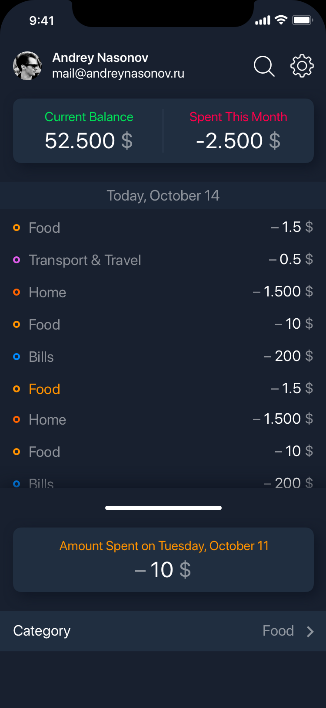

# Budget X #
### An app that tracks your personal finances ###

    11/11/2019 09:09 AM
    11/12/2019 02:17 PM

#### Extra Packages ####
    Expo Font
    Expo AV
    Jest
    Detox

#### Purpose ####
React native mobile app for keeping track of personal accounts and transactions

#### Author ####
Eric Phung

#### Created ####
Sun Nov  3 04:53:21 2019

#### Updated ####
06/11/2019 02:57 PM
12/11/2019 05:03 AM

#### Category ####
Finance
<!-- 
 -->
#### Features
*   Beautiful user interface
*   Add/remove/edit transactions
*   Custom categories
*   Advertisement free!
*   Sync across different devices
*   Back up data to cloud
*   Export data as csv, html, qif
*   Link personal bank accounts
*   Multiple accounts
*   Different currencies
*   Reports and charts
