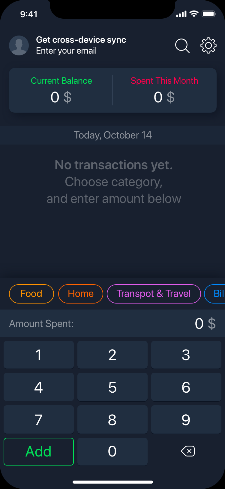

# Budget X #
### An app that tracks your personal finances ###

    FILENAME:  README.md
    PURPOSE:   App repository information
    AUTHOR:    Eric Phung
    CREATED:   11/11/2019 09:09 AM

#### Packages ####
    "dependencies": {
        "expo": "^35.0.0",
        "expo-font": "~7.0.0",
        "react": "16.8.3",
        "react-dom": "16.8.3",
        "react-native": "https://github.com/expo/react-native/archive/sdk-35.0.0.tar.gz",
        "react-native-gesture-handler": "~1.3.0",
        "react-native-swipe-list-view": "^2.0.3",
        "react-native-vector-icons": "^6.6.0",
        "react-native-web": "^0.11.7",
        "react-navigation": "^4.0.10",
        "react-navigation-stack": "^1.10.3"
    },

#### Purpose ####
React native mobile app for keeping track of personal accounts and transactions

#### Author ####
Eric Phung

#### Created ####
Sun Nov  3 04:53:21 2019

#### Updated ####
06/11/2019 02:57 PM
12/11/2019 05:03 AM

#### Category ####
Finance
<!-- 
 -->
#### Features
*   Beautiful user interface
*   Add/remove/edit transactions
*   Custom categories
*   Advertisement free!
*   Sync across different devices
*   Back up data to cloud
*   Export data as csv, html, qif
*   Link personal bank accounts
*   Multiple accounts
*   Different currencies
*   Reports and charts
