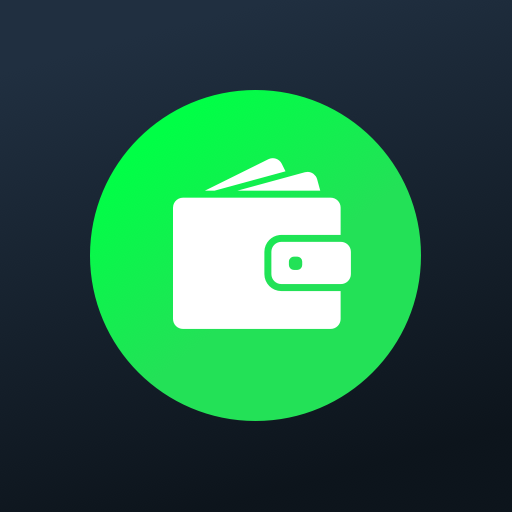
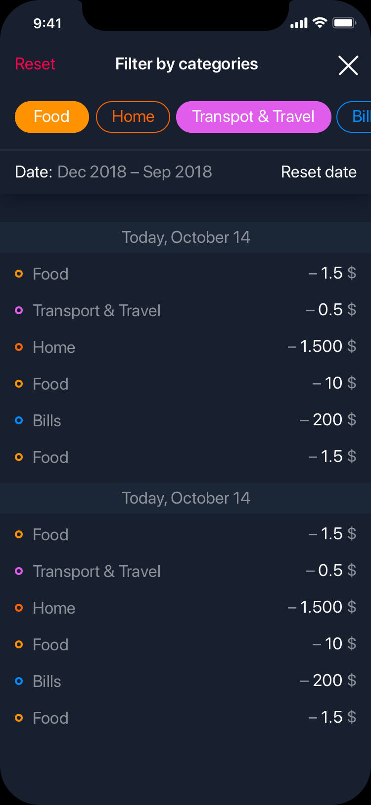
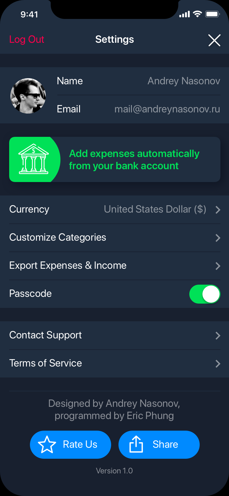

# Budget X App #

    PURPOSE:    personal finance mobile app  made with RN and Expo
    PACKAGES:   react-native-swipe-list-view
    Author:     Eric Phung
    Created:    Sun Nov  3 04:53:21 2019
    Updated:
                11/06/2019 02:57 PM
                11/12/2019 05:03 AM
                11/13/2019 05:22 AM
                11/11/2019 09:09 AM
                11/12/2019 02:17 PM
                11/13/2019 05:22 AM
                11/27/2019 12:41 AM
                12/03/2019 11:47 AM

